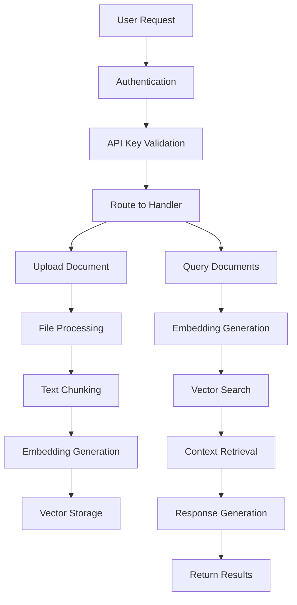

# RAG Application Flow Documentation

This document provides a comprehensive overview of the RAG (Retrieval-Augmented Generation) application's architecture and flow. The application is built using FastAPI, FAISS for vector storage, OpenAI for embeddings and generation, and Firebase for authentication.

## Table of Contents
1. [Application Overview](#application-overview)
2. [Core Components](#core-components)
3. [Application Flow](#application-flow)
4. [API Endpoints](#api-endpoints)
5. [Authentication & Security](#authentication--security)
6. [Data Processing Pipeline](#data-processing-pipeline)
7. [Frontend Integration](#frontend-integration)

## Application Overview

The RAG application enables users to upload documents, process them into embeddings, store them in a vector database, and then perform semantic searches using natural language queries. The system uses OpenAI's GPT models for both embeddings and response generation.

### Key Features:
- Multi-format document support (PDF, Excel, Word, Text)
- Semantic search using vector embeddings
- Retrieval-Augmented Generation for contextual responses
- Firebase authentication
- API key-based access control

## Core Components

### 1. Main Application (`main.py`)
The entry point of the application that sets up the FastAPI server, routes, middleware, and security.

### 2. Models (`models.py`)
Pydantic models for data validation and serialization.

### 3. File Processing (`file_processor.py`)
Handles different file formats (PDF, Excel, Word, Text) and converts them to text.

### 4. Embedding Service (`embedding_service.py`)
Chunks text and generates embeddings using OpenAI's API.

### 5. Vector Store (`vector_store.py`)
Manages FAISS vector database for storing and retrieving document embeddings.

### 6. Query Service (`query_service.py`)
Implements the RAG pipeline using LangGraph for orchestrating retrieval and generation.

### 7. Firebase Authentication (`firebase_admin_auth.py`)
Handles user authentication and API key management.

### 8. Logging Configuration (`logging_config.py`)
Sets up application logging.

## Application Flow



### Detailed Flow:

1. **User Authentication**
   - Users register/login with email and password
   - Firebase generates ID tokens
   - Users can generate API keys for authenticated access

2. **Document Upload**
   - Users upload documents through the API
   - Files are processed based on their format (PDF, Excel, Word, Text)
   - Text content is extracted and chunked into smaller pieces

3. **Embedding Generation**
   - Each text chunk is converted to a vector embedding using OpenAI's embedding model
   - Embeddings are stored in the FAISS vector database

4. **Query Processing**
   - User queries are converted to embeddings
   - Similar documents are retrieved from the vector store
   - Context is provided to OpenAI for generating contextual responses

## API Endpoints

### Authentication Endpoints

#### Register User
```python
@app.post("/register")
async def register_user(user_data: UserCreate):
    """
    Register a new user.
    """
    user_id = create_firebase_user(user_data.email, user_data.password)
    if not user_id:
        raise HTTPException(status_code=400, detail="Could not create user. The email might already be in use.")
    
    return APIResponse(success=True, message="User created successfully.")
```

#### Login
```python
@app.post("/login")
async def login_for_id_token(user_data: UserLogin):
    """
    Login a user and return an ID token.
    """
    user_id, id_token = login_with_email_and_password(user_data.email, user_data.password)
    if not user_id:
        raise HTTPException(status_code=401, detail="Invalid email or password")
    
    return APIResponse(success=True, message="Login successful", data={"id_token": id_token})
```

#### Generate API Key
```python
@app.post("/generate-key")
async def generate_new_api_key(user_id: str = Depends(get_current_user)):
    """Generate a new API key for the authenticated user."""
    api_key = generate_api_key(user_id)
    return APIResponse(success=True, message="API Key generated successfully", data={"api_key": api_key})
```

### Document Processing Endpoints

#### Upload Text Document
```python
@app.post("/upload/text", dependencies=[Depends(api_key_header)])
async def upload_text_document(document: DocumentUpload):
    """
    Upload and process text document for embedding and storage
    """
    try:
        # Process the document
        processed_data = embedding_service.process_document(
            content=document.content,
            metadata=document.metadata
        )
        
        # Add to vector store
        success = vector_store.add_documents(processed_data)
        
        if success:
            return APIResponse(
                success=True,
                message=f"Document processed successfully. Created {processed_data['total_chunks']} chunks.",
                data={"chunks_created": processed_data['total_chunks']}
            )
        else:
            raise HTTPException(status_code=500, detail="Failed to store document")
            
    except Exception as e:
        logger.error(f"Error processing text document: {str(e)}", exc_info=True)
        raise HTTPException(status_code=500, detail=f"Document processing failed: {str(e)}")
```

#### Upload File Document
```python
@app.post("/upload/file", dependencies=[Depends(api_key_header)])
async def upload_file_document(file: UploadFile = File(...)):
    """Upload and process various file formats (PDF, Excel, Word, Text)"""
    try:
        # Read file content
        file_content = await file.read()
        
        # Process file based on its format
        processing_result = file_processor.process_file(file_content, file.filename)
        
        if not processing_result['success']:
            raise HTTPException(status_code=400, detail=processing_result['error'])
        
        # Process the extracted content
        processed_data = embedding_service.process_document(
            content=processing_result['content'],
            metadata=processing_result['metadata']
        )
        
        # Add to vector store
        success = vector_store.add_documents(processed_data)
        
        if success:
            return APIResponse(
                success=True,
                message=f"File '{file.filename}' processed successfully. Created {processed_data['total_chunks']} chunks.",
                data={
                    "filename": file.filename,
                    "file_type": processing_result['metadata']['file_type'],
                    "chunks_created": processed_data['total_chunks'],
                    "content_length": processing_result['metadata']['content_length']
                }
            )
        else:
            raise HTTPException(status_code=500, detail="Failed to store document")
            
    except HTTPException:
        raise
    except Exception as e:
        logger.error(f"Error processing file: {str(e)}", exc_info=True)
        raise HTTPException(status_code=500, detail=f"File processing failed: {str(e)}")
```

### Query Endpoint
```python
@app.post("/query", response_model=QueryResponse, dependencies=[Depends(api_key_header)])
async def query_documents(request: QueryRequest):
    """
    Query the knowledge base and get AI-generated response
    """
    try:
        # Process query through RAG pipeline
        result = rag_orchestrator.process_query(request.query)
        
        return QueryResponse(
            answer=result["answer"],
            sources=result["sources"][:request.max_results],
            confidence=1.0 if result["context_used"] else 0.0
        )
        
    except Exception as e:
        logger.error(f"Error processing query: {str(e)}", exc_info=True)
        raise HTTPException(status_code=500, detail=f"Query processing failed: {str(e)}")
```

## Authentication & Security

The application uses Firebase for authentication and API key-based access control for all endpoints except registration and login.

### Firebase Authentication
```python
# Security schemes
http_bearer_scheme = HTTPBearer()
api_key_scheme = APIKeyHeader(name='X-API-Key')

async def get_current_user(token: str = Depends(http_bearer_scheme)) -> str:
    user_id = verify_firebase_token(token.credentials)
    if not user_id:
        raise HTTPException(status_code=401, detail="Invalid or expired token")
    return user_id

async def api_key_header(x_api_key: str = Depends(api_key_scheme)):
    if not validate_api_key(x_api_key):
        raise HTTPException(status_code=401, detail="Invalid or expired API Key")
    return x_api_key
```

### API Key Generation and Validation
```python
def generate_api_key(user_id: str) -> str:
    """
    Generate a new API key for a user and store it in Firestore.
    """
    db = firestore.client()
    api_key = secrets.token_hex(32)
    key_data = {
        'user_id': user_id,
        'api_key': api_key,
        'created_at': datetime.datetime.now(timezone.utc),
        'active': True,
        'usage_count': 0,
        'expires_at': datetime.datetime.now(timezone.utc) + datetime.timedelta(days=365) # Key expires in 1 year
    }
    db.collection('api_keys').document(api_key).set(key_data)
    logger.info(f"Generated API key for user {user_id}")
    return api_key

def validate_api_key(api_key: str):
    """
    Validate an API key and increment its usage count.
    """
    db = firestore.client()
    key_ref = db.collection('api_keys').document(api_key)
    key_doc = key_ref.get()

    if not key_doc.exists:
        return None

    key_data = key_doc.to_dict()

    if not key_data.get('active') or key_data.get('expires_at') < datetime.datetime.now(timezone.utc):
        return None

    # Increment usage count
    key_ref.update({'usage_count': firestore.Increment(1)})
    
    return key_data
```

## Data Processing Pipeline

### File Processing
The `FileProcessor` class handles different file formats:

```python
class FileProcessor:
    """Handle different file formats for document processing"""
    
    def __init__(self):
        self.supported_formats = {
            '.txt': self._process_txt,
            '.pdf': self._process_pdf,
            '.xlsx': self._process_excel,
            '.xls': self._process_excel,
            '.docx': self._process_docx,
            '.doc': self._process_docx
        }
```

### Text Chunking and Embedding
The `EmbeddingService` handles text chunking and embedding generation:

```python
class EmbeddingService:
    def chunk_text(self, text: str) -> List[str]:
        """
        Simple text chunking by character count
        """
        chunk_size = config.CHUNK_SIZE
        overlap = config.CHUNK_OVERLAP
        chunks = []
        
        for i in range(0, len(text), chunk_size - overlap):
            chunk = text[i:i + chunk_size]
            if chunk.strip():
                chunks.append(chunk)
        
        return chunks
    
    def create_embeddings(self, texts: List[str]) -> List[List[float]]:
        """
        Create embeddings using OpenAI's embedding model
        """
        try:
            logger.info(f"Creating embeddings for {len(texts)} chunks.")
            response = openai.embeddings.create(
                model=config.EMBEDDING_MODEL,
                input=texts
            )
            logger.info("Embeddings created successfully.")
            return [data.embedding for data in response.data]
        except Exception as e:
            logger.error(f"Failed to create embeddings: {str(e)}", exc_info=True)
            raise Exception(f"Failed to create embeddings: {str(e)}")
```

### Vector Storage
The `FAISSVectorStore` manages the FAISS vector database:

```python
class FAISSVectorStore:
    def add_documents(self, processed_data: Dict[str, Any]) -> bool:
        """Add processed document data to the vector store"""
        logger.info(f"Adding {processed_data['total_chunks']} new chunks to the vector store.")
        try:
            embeddings = processed_data["embeddings"]
            chunks = processed_data["chunks"]
            metadata = processed_data["metadata"]
            
            # Convert embeddings to numpy array
            embedding_matrix = np.array(embeddings, dtype=np.float32)
            
            # Add embeddings to FAISS index
            self.index.add(embedding_matrix)
            
            # Store document chunks with metadata
            for i, chunk in enumerate(chunks):
                doc_data = {
                    "chunk": chunk,
                    "metadata": metadata,
                    "chunk_index": i,
                    "doc_id": len(self.documents)
                }
                self.documents.append(doc_data)
            
            # Save the updated index
            self._save_index()
            
            logger.info("Documents added successfully.")
            return True
        except Exception as e:
            logger.error(f"Failed to add documents: {str(e)}", exc_info=True)
            raise Exception(f"Failed to add documents: {str(e)}")
    
    def search(self, query_embedding: List[float], k: int = 5) -> List[Dict[str, Any]]:
        """Search for similar documents"""
        if self.index is None or len(self.documents) == 0:
            logger.warning("Search attempted on an empty vector store.")
            return []
        
        logger.info(f"Searching for {k} nearest neighbors.")
        try:
            # Convert query embedding to numpy array with proper shape
            query_vector = np.array([query_embedding], dtype=np.float32)
            
            # Ensure k doesn't exceed available documents
            k = min(k, len(self.documents))
            
            # Search in FAISS index
            distances, indices = self.index.search(query_vector, k)
            
            # Retrieve matching documents
            results = []
            for i, idx in enumerate(indices[0]):
                if idx != -1 and idx < len(self.documents):  # Check for valid index
                    doc = self.documents[idx].copy()
                    doc["similarity_score"] = float(distances[0][i])
                    results.append(doc)
            
            logger.info(f"Found {len(results)} matching documents.")
            return results
        except Exception as e:
            logger.error(f"Failed to search: {str(e)}", exc_info=True)
            raise Exception(f"Failed to search: {str(e)}")
```

## Query Processing with RAG

The `RAGOrchestrator` uses LangGraph to orchestrate the retrieval and generation process:

```python
class RAGOrchestrator:
    """LangGraph orchestrator for RAG workflow"""
    
    def _create_workflow(self):
        """Create LangGraph workflow"""
        # Create state graph with dict as state type
        workflow = StateGraph(dict)
        
        # Add nodes for our tools
        workflow.add_node("fetch_data", self.data_fetcher.fetch_data)
        workflow.add_node("generate_answer", self.answer_generator.generate_answer)
        
        # Define the workflow edges
        workflow.set_entry_point("fetch_data")
        workflow.add_edge("fetch_data", "generate_answer")
        workflow.add_edge("generate_answer", END)
        
        return workflow.compile()
    
    def process_query(self, query: str) -> Dict[str, Any]:
        """
        Process a user query through the RAG pipeline
        """
        logger.info(f"Processing query: {query}")
        try:
            # Initialize state as a dict
            initial_state = {
                "query": query,
                "retrieved_docs": [],
                "context": "",
                "answer": ""
            }
            
            # Run the workflow
            final_state = self.workflow.invoke(initial_state)
            
            # Prepare response
            response = {
                "answer": final_state.get("answer", ""),
                "sources": [
                    {
                        "content": doc["chunk"][:200] + "...",  # Truncate for display
                        "metadata": doc["metadata"],
                        "similarity_score": doc.get("similarity_score", 0)
                    }
                    for doc in final_state.get("retrieved_docs", [])
                ],
                "context_used": len(final_state.get("retrieved_docs", [])) > 0
            }
            
            logger.info("Query processed successfully.")
            return response
            
        except Exception as e:
            logger.error(f"Error processing query: {str(e)}", exc_info=True)
            return {
                "answer": f"Error processing query: {str(e)}",
                "sources": [],
                "context_used": False
            }
```

## Frontend Integration

The frontend example demonstrates how to interact with the API using React and Firebase:

```javascript
// Generate API Key
const handleGenerateApiKey = async () => {
  if (!user) {
    setError('You must be logged in to generate an API key.');
    return;
  }

  setLoading(true);
  setError(null);

  try {
    const token = await user.getIdToken();
    const response = await fetch('http://localhost:8000/generate-key', {
      method: 'POST',
      headers: {
        'Authorization': `Bearer ${token}`
      }
    });

    if (!response.ok) {
      const errData = await response.json();
      throw new Error(errData.detail || 'Failed to generate API key');
    }

    const data = await response.json();
    setApiKey(data.data.api_key);
  } catch (err) {
    setError(err.message);
  } finally {
    setLoading(false);
  }
};

// Query the API
const handleQuery = async () => {
  if (!apiKey) {
    setError('You must have an API key to query the API.');
    return;
  }

  setLoading(true);
  setError(null);
  setQueryResult(null);

  try {
    const response = await fetch('http://localhost:8000/query', {
      method: 'POST',
      headers: {
        'Content-Type': 'application/json',
        'X-API-Key': apiKey
      },
      body: JSON.stringify({ query: query, max_results: 5 })
    });

    if (!response.ok) {
      const errData = await response.json();
      throw new Error(errData.detail || 'Failed to query');
    }

    const data = await response.json();
    setQueryResult(data);
  } catch (err) {
    setError(err.message);
  } finally {
    setLoading(false);
  }
};
```

## Dependencies

The application requires the following dependencies (from `requirements.txt`):

```
fastapi==0.104.1
uvicorn[standard]==0.24.0
openai==1.3.0
faiss-cpu==1.7.4
langchain==0.0.350
langgraph==0.0.20
python-multipart==0.0.6
pydantic==2.5.0
numpy==1.24.3
PyPDF2==3.0.1
openpyxl==3.1.2
pandas==2.0.3
python-docx==0.8.11
firebase-admin==6.5.0
requests==2.31.0
```

## Conclusion

This RAG application provides a complete solution for document processing, semantic search, and contextual question answering. The modular architecture allows for easy extension and maintenance, with clear separation of concerns between different components.